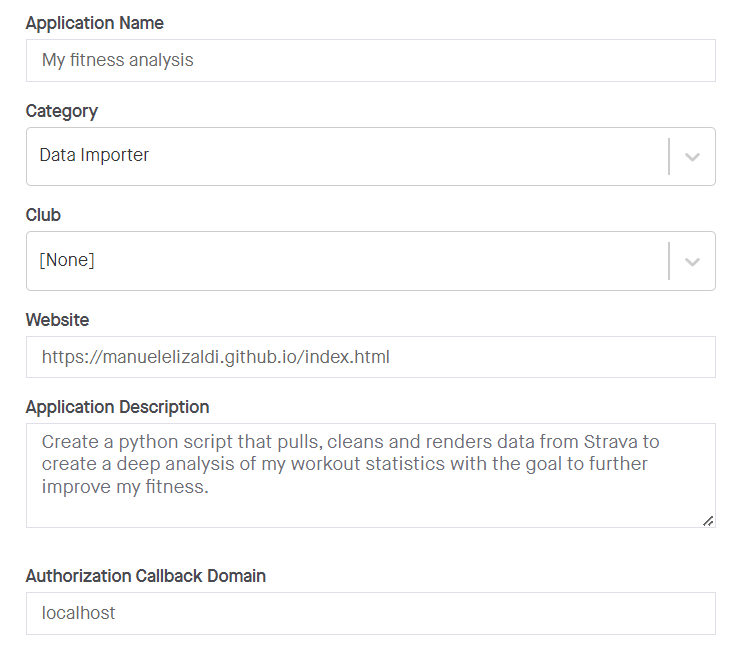

# How To Setup This Project
Before you can use the [PyStrava Notebook](https://github.com/ManuelElizaldi/PyStrava/blob/main/PyStrava_Notebook.ipynb) or the [PyStrava Script](https://github.com/ManuelElizaldi/PyStrava/blob/main/PyStrava.py) you need to follow these instructions: 

## Strava - API Access
Before we can start using Strava's API we first need to complete a couple of steps to gain access:

1. If you haven't already, create an account in [Strava](https://www.strava.com/)
2. Head to your Profile Settings and then click on “Privacy Controls” and set “Profile Page” and “Activities” to Everyone, like this:


3. Create a Strava application inside this link: [Create a Strava Application](https://www.strava.com/settings/api)
4. You can answer all the questions however you want, just make sure the “Authorization Callback Domain” field is set to “localhost”. Like so:



5. Write down your client id and client secret. 

After those steps are done, before you use any of the API calls to pull data, we need to get our authorization code, which we get by opening the following link:

``` python
https://www.strava.com/oauth/authorize?client_id={client_id}&response_type=code&redirect_uri=http://localhost/&approval_prompt=force&scope=profile:read_all,activity:read_all
```

In the [PyStrava Notebook](https://github.com/ManuelElizaldi/PyStrava/blob/main/PyStrava_Notebook.ipynb) and the [PyStrava Script](https://github.com/ManuelElizaldi/PyStrava/blob/main/PyStrava.py) I use the package [Webbrowser](https://docs.python.org/3/library/webbrowser.html) to open this page directly from the script but you can do it manually too. This code will expire, so if you are not getting access you might need to run it again. Change the ```{client_id}``` with your own and you shuold be able to access the authorization window. 

When you open the page you will see this window, click on authorize.


After you authorize, you will see the following page, don't panic, this is what we want. Save the code (red box) in your script. Now you have all the necessary information and authorizations to use Strava's API. While the script is running, make sure you don't close this window.


Make sure to declare your data dictionary-variable in your script or declare it in a config.py file and import it to your main script. Your data dictionary should look like this:

``` python
data = {
'client_id': 'xxxx',
'client_secret':'xxxx',
'code': 'xxxx',
'grant_type':'authorization_code'
}
```

This dictionary holds the required credentials to run any Strava API.

If these instructions were not clear I suggest you read through this page: 
- [Strava's API documentation](https://developers.strava.com/)

## Google Sheets API 
In order to use the package Pygsheets to uplaod data to Google Drive and Gspread to download it from our python script, we first need to create a project in the [Google Developers Console](https://console.cloud.google.com/projectselector2/apis/dashboard?pli=1&supportedpurview=project&authuser=1). In the box labeled “Search for APIs and Services”, search for “Google Drive API” and enable it, then in the box labeled “Search for APIs and Services”, search for “Google Sheets API” and enable it. 

After the API is enabled, we have to get a Google service account, which is an account intended for non-human users, i.e. our python script. These are the steps to getting a service account:

1. In the "API & Services", go to "Credentials".
2. Choose "Create Credentials".
3. Click on "Service account key".
4. Answer all the questions and then click on "Create" and "Done".
5. Click "Manage service accounts" in the "Service accounts section".
6. Press on ⋮ near recently created service account and select “Manage keys” and then click on “ADD KEY > Create new key”
7. Select the JSON option and press "Continue".

The resulting file will look something like this:
``` python
{
  "type": "service_account",
  "project_id": "pacific-castle-303123",
  "private_key_id": "xxx",
  "private_key": "xxx",
  "client_email": "manuel-elizaldi@pacific-castle-303123.iam.gserviceaccount.com",
  "client_id": "xxx",
  "auth_uri": "https://accounts.google.com/o/oauth2/auth",
  "token_uri": "https://oauth2.googleapis.com/token",
  "auth_provider_x509_cert_url": "https://www.googleapis.com/oauth2/v1/certs",
  "client_x509_cert_url": "https://www.googleapis.com/robot/v1/metadata/x509/manuel-elizaldi%40pacific-castle-303123.iam.gserviceaccount.com"
}
``` 
Make sure to add the path to the json file like so in the script:

```python 
service_file_path = r'\GoogleCredentials.json'
```
Or add it to your Config.py file. I used the path option. 

From this Json, grab the ```"client_email"``` and share your Google sheet with it just like you would share it with somone else.

And also declare the sheet id which you can get from the link of the Google Sheet you created to store the data from this project:


```
spreadsheet_id = '1pomkAzlndHBl_czERrwKkoZFUkJRGFjyhRTeoWA6CS4'
```

After all this steps are done, now you can run the [PyStrava Notebook](https://github.com/ManuelElizaldi/PyStrava/blob/main/PyStrava_Notebook.ipynb) and the [PyStrava Script](https://github.com/ManuelElizaldi/PyStrava/blob/main/PyStrava.py) to extract all your workouts from Strava and upload them to Google Drive! 

If these instructions were not clear I suggest you read through this article: 
- [Gspread Authentication](https://docs.gspread.org/en/latest/oauth2.html#enable-api-access)

## How to Use
In order for the [PyStrava Script](https://github.com/ManuelElizaldi/PyStrava/blob/main/PyStrava.py) to work, we need to make sure we create 3 tabs inside the Google Sheet file that will hold our data. If you don't want to modify the script, make sure you create the following tabs with the same syntax:

- All_Workouts_Table
- All_Workouts_Desc_Table
- Activities_Breakdown

If these tabs don't exist or are misspelled you will get an error.
After running the script you should see all your data inside the file.

## Updating Your Existing Data
If you already have data in your Google Sheet and you just want to add new workouts, you can run the [Update Google Sheet](https://github.com/ManuelElizaldi/PyStrava/blob/main/Update_GoogleSheet.py). This will add any new workouts.

## Copy The Google Looker Dashboard Template 
If you want to use this dashboard as a template for your own analysis, follow these steps. 
1. Open the [Dashboard](https://lookerstudio.google.com/reporting/c8efd23d-4f39-42d1-a336-26aebac76fa5), and on the  ⋮  button in the top right corner, then click "Make a copy".
2. In the New Data Source section, click on "Create a Data Source".


3. Click on "Google Sheets" in the Google Connectors menu and select the Google Sheet you created for this project. Then, connect it to the dashboard.
4. If you are going to use the start_lat, start_long, end_lat and end_long columns, make sure you change their data type to Longitude, Latitude


After these steps are done, click "Add to Report" on the top right corner and you will have a copy of this dashboard inside your Google Looker. 

[Return to README](https://github.com/ManuelElizaldi/PyStrava/blob/main/README.md)
