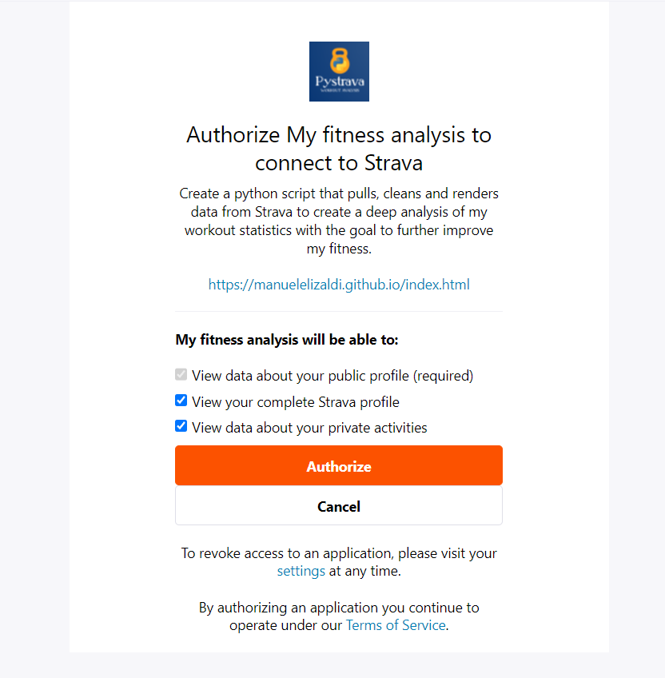
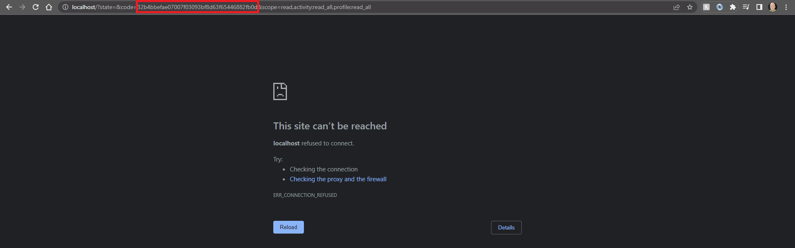

<h1 align="center">
  <br>
  #WORK IN PROGRESS :no_entry:
  <br>
 </h1>
 
<h1 align="center">
  <br>
  <a href=""></a>
  <br>
  PyStrava
  <br>
</h1>

<h3 align="center">
  <br>
  :star: Star this project on GitHub — it motivates me a lot and you will stay up to date on the project!
  <br>
  <br>
  
  <a href="https://manuelelizaldi.github.io/index.html" target="_blank" class="button"></a>
  <br>
</h3>

# Workout-Analysis
# Table of Contents:
- [Introduction & Project Desription](#introduction--project-desription)
- [Goals](#goals)
- [Technologies Used](#technologies-used)
- [Project Setup](#project-setup)

## Introduction & Project Desription

During the pandemic I promised myself to set my physical health as one of my priorities. To do that, I wanted to use technology to help me achieve my goals by having a digital record of all the workouts I've done in order to force myself to stay disciplined and on track. I've been using my Garmin smartwatch and Strava's app to keep a log of all my acitivites. Since starting this journey I have seen progress in physical health, physical abilities and mental health. I have reached goals that never seemed possible and started to believe in myself. I have discovered that I am much more capable of what I initially thought. When I first started working out consistently running 10km was miserable, now I have completed [Austin's Half Marathon](https://youraustinmarathon.com/), a [10km Spartan Race](https://www.spartan.com/) and I am registered for Austin's 2024 Marathon and an Ultra Marathon (50km) in July 2023. For this reason I am also gonna write a section about my philosophy of traning in hopes that someone looking to better their health feels inspired by this project and can chase that better version of themselves that is out there waiting to be found. 

when I first created my [Strava](https://www.strava.com/dashboard) account. At first, this data was gathered using my cellphone, linking Samsung's Health App to Strava, but then I switched to a [Garming Pheonix 6](https://www.garmin.com/en-US/p/702902) smart watch. This allowed me to gatter more metrics which I use to answer questions about my progress and then build a machine learning model. 

I've been logging workouts since 05-20-2020 and as of 03-26-2023 I'v logged over 600 different workouts consisting of different types of physical exercises. This gives me enough data to accomplish my goals for this project.

## Goals
1. Build a python script that extracts all my workout data from Strava.
2. Clean and prepare data to be uploaded to Google Drive
3. Build a dashboard containing workout metrics in Google Looker.

The data pipeline for this project looks like this:


Additionally, with this data I will build a machine learning multi label classification model to classify my workouts based in 4 categories:
  1) No Effort
  2) Low Effort 
  3) Medium Effort 
  4) High Effort

## Technologies Used
### Programming Language
- Python 3.8.5
### Dashboard
- Google Looker Studio
### Packages
- Pandas 1.1.3
- numpy 1.22.4
- matplotlib 3.3.2
- Requests 2.28.2
- Pygsheets 2.0.6
- scikit-learn 1.2.2
### Relevant Documentation
- [Strava's API documentation](https://developers.strava.com/)
- [Pygsheets](https://pygsheets.readthedocs.io/en/stable/)
- [Requests](https://requests.readthedocs.io/en/latest/)
- [Gspread Authentication](https://docs.gspread.org/en/latest/oauth2.html#enable-api-access)

## Project Setup
Before you can use the [PyStrava Notebook](https://github.com/ManuelElizaldi/PyStrava/blob/main/PyStrava_Notebook.ipynb) or the [PyStrava Script](https://github.com/ManuelElizaldi/PyStrava/blob/main/PyStrava.py) you need to follow these instructions: 

### Strava - API access
Before we can start using Strava's API we first need to complete a couple of steps to gain access:

1. If you haven't already, create an account in [Strava](https://www.strava.com/)
2. Head to your Profile Settings and then click on “Privacy Controls” and set “Profile Page” and “Activities” to Everyone, like this:


3. Create a Strava application inside this link: [Create a Strava Application](https://www.strava.com/settings/api)
4. You can answer all the questions however you want, just make sure the “Authorization Callback Domain” field is set to “localhost”. Like so:


After those steps are done, before you use any of the API calls to pull data, we need to get our authorization code, which we get by opening the following link:

``` python
https://www.strava.com/oauth/authorize?client_id={client_id}&response_type=code&redirect_uri=http://localhost/&approval_prompt=force&scope=profile:read_all,activity:read_all
```

In the WorkoutAnalysis.py file I use the package [Webbrowser](https://docs.python.org/3/library/webbrowser.html) to open this page directly from the script but you can do it manually too, just note that this code will expire. Change the ```{client_id}``` with your own and you shuold be able to access the authorization window. 

When you open the page you will see this window, click on authorize.



After you authorize, you will see the following page, don't panic, this is what we want. Save the code (red box) in your script. Now you have all the necessary information and authorizations to use Strava's API.



Make sure to declare your data dictionary-variable in your script or declare it in a config.py file and import it to your main script. Your data dictionary should look like this:

``` python
data = {
'client_id': 'xxxx',
'client_secret':'xxxx',
'code': 'xxxx',
'grant_type':'authorization_code'
}
```

This dictionary holds the required credentials to run any Strava API.

If these instructions were not clear I suggest you read through these articles: 
- [Strava's API documentation](https://developers.strava.com/)

### Google Sheets API 
In order to use the package Pygsheets to uplaod data to Google Drive from our python script, we first need to create a project in the [Google Developers Console](https://console.cloud.google.com/projectselector2/apis/dashboard?pli=1&supportedpurview=project&authuser=1). In the box labeled “Search for APIs and Services”, search for “Google Drive API” and enable it, then in the box labeled “Search for APIs and Services”, search for “Google Sheets API” and enable it. 

After the API is enabled, we have to get a Google service account, which is an account intended for non-human users, i.e. our python script. These are the steps to getting a service account:

1. In the "API & Services", go to "Credentials".
2. Choose "Create Credentials".
3. Click on "Service account key".
4. Answer all the questions and then click on "Create" and "Done".
5. Click "Manage service accounts" in the "Service accounts section".
6. Press on ⋮ near recently created service account and select “Manage keys” and then click on “ADD KEY > Create new key”
7. Select the JSON option and press "Continue".

The resulting file will look something like this:
``` python
{
  "type": "service_account",
  "project_id": "pacific-castle-303123",
  "private_key_id": "xxx",
  "private_key": "xxx",
  "client_email": "manuel-elizaldi@pacific-castle-303123.iam.gserviceaccount.com",
  "client_id": "118237617576468519006",
  "auth_uri": "https://accounts.google.com/o/oauth2/auth",
  "token_uri": "https://oauth2.googleapis.com/token",
  "auth_provider_x509_cert_url": "https://www.googleapis.com/oauth2/v1/certs",
  "client_x509_cert_url": "https://www.googleapis.com/robot/v1/metadata/x509/manuel-elizaldi%40pacific-castle-303123.iam.gserviceaccount.com"
}
``` 
Make sure to add the path to the json file like so in the script:

```python 
service_file_path = r'\GoogleCredentials.json'
```

From this Json, grab the ```"client_email"``` and share your Google sheet with it just like you would share it with somone else.

And also declare the sheet id which you can get from the link of the Google Sheet you created to store the data from this project:


After all this steps are done, now you can run the WorkoutAnalysis.py file and extract all your workouts from Strava! 

If these instructions were not clear I suggest you read through these articles: 
- [Gspread Authentication](https://docs.gspread.org/en/latest/oauth2.html#enable-api-access)


------------------------------------------------------------------

## Analysis 


## Dashboard

## Areas Of Improvement
- Real time stats
- Merge with garmin data for more variables - more precise model
- gather more data 
- ratios between variables
- workouts like bouldering are not being tracked 
- strenght output is not being tracked 
