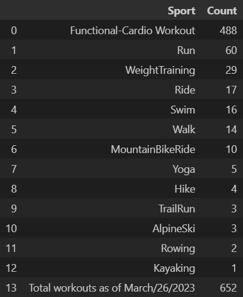

# Workout-Analysis
#WORK IN PROGRESS :no_entry:
## Introduction
During the pandemic I promised myself to set my physical health as one of my priorities. To do that, I wanted to use technology to help me achieve my goals by having a digital record of all the workouts I've done in order to force myself to stay disciplined and on track. I've been using my Garmin smartwatch and Strava's app to keep a log of all my acitivites. In this project one of my objectives is to use the statistical tools I've learned through out my career and build a dashboard where I can visualize my progress.  

Since starting this journey I have seen progress in physical health, physical abilities and mental health. I have reached goals that never seemed possible and started to believe in myself. I have discovered that I am much more capable of what I initially thought. When I first started working out consistently running 10km was miserable, now I have completed [Austin's Half Marathon](https://youraustinmarathon.com/), a [10km Spartan Race](https://www.spartan.com/) and I am registered for Austin's 2024 Maratho and an Ultra Marathon (50km) in July 2023. For this reason I am also gonna write a section about my philosophy of traning in hopes that someone looking to better their health feels inspired by this project and can chase that better version of themselves that is out there waiting to be found.

## Goals
As I have stated before, I wanted to use techonology to help me reach my goals, therefore I built a Python script that pulls data from Strava's server, cleans it and then uploads it to Google Sheets. With the output file I can produce a dashboard in Google Looker Studio where I can find all my workout statistics. 

## Project Description
In order to use any of the scripts in this project, first you have to create an account in [Strava](https://www.strava.com/) then, you have to start a App inside your profile so that you get the necessary credentials, i.e. Client ID and Client Secret. Also, you have to change some of the privacy setting in your profile, which can be found inside your profile and then go to the menu: Privacy Controls, here you have to set the 'Who Can See' settings for Profile Page and Activities to everyone like so: 

### Technologies Used
#### Programming Language
- Python 3.8.5
#### Packages
- Pandas 1.1.3
- Requests 2.28.2
- Gspread 5.7.2
- Pygsheets 2.0.6
- Webbrowser
#### Relevant Documentation
[Strava's API documentation](https://developers.strava.com/)

I started recording since 05-20-2020 and as of 03-26-2023 I'v logged over 600 different workouts, ranging from running to skiing, we will take a closer look at the different activities.

As of 2-11-2023 I have logged over 600 activities consisting of different types of physical exercises. I started recording my workouts in order to keep me on track of my goals.  to determine some basic questions like, how consistent have I been, 

when I first created my [Strava](https://www.strava.com/dashboard) account. At first, this data was gathered using my cellphone, linking Samsung's Health App to Strava, but then I switched to a [Garming Pheonix 6](https://www.garmin.com/en-US/p/702902) smart watch. This allowed me to get more metrics like heart rate, which I use to calculate the approximate calories I burn in a workout

### Analysis 
### Dashboard
