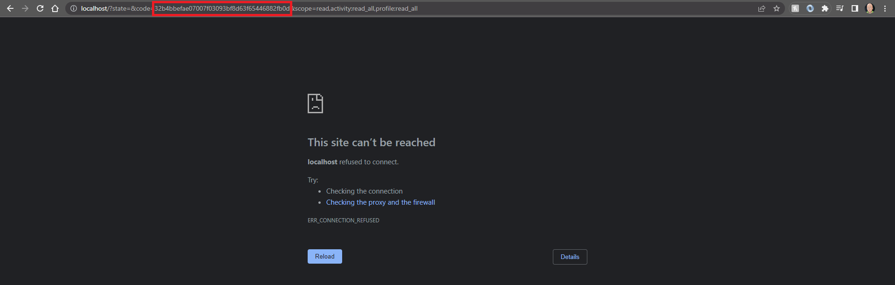

<h1 align="center">
  <br>
  <a href=""></a>
  <br>
  PyStrava
  <br>
</h1>

<h3 align="center">
  <br>
  :star: Star this project on GitHub — I plan on incorporating new features overtime! 
  <br>
  <br>
  
  <a href="https://manuelelizaldi.github.io/index.html" target="_blank" class="button"></a>
  <br>
</h3>

# Workout-Analysis
# Table of Contents:
- [Introduction & Project Desription](#introduction--project-desription)
- [Goals](#goals)
- [Technologies Used](#technologies-used)
- [Project Setup](#project-setup)
    - [Strava API Access](#strava---api-access)
    - [Google API Access](#google-sheets-api)
    - [How to Use](#how-to-use)
    - [Updating Your Data](#updating-your-existing-data) 
- [Analysis & Dashboard](#analysis--dashboard)
    - [Sports Type Breakdown](#sports-type-breakdown)
    - [Copy This Dashboard Template](#copy-this-dashboard-template) 
    - [Descriptive Statistics](#descriptive-statistics) 
- [Level of Effort Score](#level-of-effort-score)
    - [How The Effort Score Is Calculated](#how-the-effort-score-is-calculated)
    - [Effort Analysis](#effort-analysis)
    - [Effort Classification: Categorizing Workouts with K-Nearest Neighbor Algorithm](#effort-classification-categorizing-workouts-with-k-nearest-neighbor-algorithm)
- [Areas of Improvement](#areas-of-improvement)

# Introduction & Project Desription

Back in 2020, during the pandemic, I promised myself to prioritize my physical health. To achieve this, I wanted to use technology. By maintaining a digital record of all my workouts, I compelled myself to stay disciplined and on track. I have been using my Garmin smartwatch and the Strava app to log all my activities. Since embarking on this journey, I have witnessed progress in my physical health, abilities, and mental well-being. I have accomplished goals that once seemed impossible, and I have gained self-belief, realizing that I am far more capable than I thought. Initially, running 10km was a struggle, but now I have completed Austin's Half Marathon, a 10km Spartan Race, and I have plans to participate in an Ultra Marathon (50km) in July 2023. Additionally, I am registered for Austin's 2024 Marathon.

Leveraging my programming and data analysis skills, I aim to explore other ways in which technology can improve my fitness journey. In this project, I utilize Strava API to download all my workouts, build an ETL pipeline to clean the data, and then upload it to a Google Sheet. This Google Sheet will serve as the foundation for a workout statistics dashboard.

Regarding the Machine Learning aspect of the project, I will utilize my workout data to train a Multi Label Classification Model that categorizes the level of effort for each activity.

# Goals
1. Build a python script that extracts all my workout data from Strava.
2. Clean and prepare data to be uploaded to Google Drive.
3. Build a dashboard containing workout metrics in Google Looker.
4. Train a K-Nearest Neighbors model to classify my workouts in 4 different categories:
    - No Effort
    - Low Effort 
    - Medium Effort 
    - High Effort

The data pipeline for this project looks like this:


# Technologies Used
## Programming Language
- Python 3.8.5
## Dashboard
- Google Looker Studio
## Packages
- Pandas 1.1.3
- numpy 1.22.4
- matplotlib 3.3.2
- Requests 2.28.2
- Pygsheets 2.0.6
- Scikit-Learn 1.2.2
- Gspread 5.7.2
- Webbrowser
## Relevant Documentation
- [Strava's API documentation](https://developers.strava.com/)
- [Pygsheets](https://pygsheets.readthedocs.io/en/stable/)
- [Requests](https://requests.readthedocs.io/en/latest/)
- [Gspread Authentication](https://docs.gspread.org/en/latest/oauth2.html#enable-api-access)

# Project Setup
Before you can use the [PyStrava Notebook](https://github.com/ManuelElizaldi/PyStrava/blob/main/PyStrava_Notebook.ipynb) or the [PyStrava Script](https://github.com/ManuelElizaldi/PyStrava/blob/main/PyStrava.py) you need to follow these instructions: 

## Strava - API Access
Before we can start using Strava's API we first need to complete a couple of steps to gain access:

1. If you haven't already, create an account in [Strava](https://www.strava.com/)
2. Head to your Profile Settings and then click on “Privacy Controls” and set “Profile Page” and “Activities” to Everyone, like this:


3. Create a Strava application inside this link: [Create a Strava Application](https://www.strava.com/settings/api)
4. You can answer all the questions however you want, just make sure the “Authorization Callback Domain” field is set to “localhost”. Like so:


After those steps are done, before you use any of the API calls to pull data, we need to get our authorization code, which we get by opening the following link:

``` python
https://www.strava.com/oauth/authorize?client_id={client_id}&response_type=code&redirect_uri=http://localhost/&approval_prompt=force&scope=profile:read_all,activity:read_all
```

In the [PyStrava Notebook](https://github.com/ManuelElizaldi/PyStrava/blob/main/PyStrava_Notebook.ipynb) and the [PyStrava Script](https://github.com/ManuelElizaldi/PyStrava/blob/main/PyStrava.py) I use the package [Webbrowser](https://docs.python.org/3/library/webbrowser.html) to open this page directly from the script but you can do it manually too. This code will expire, so if you are not getting access you might need to run it again. Change the ```{client_id}``` with your own and you shuold be able to access the authorization window. 

When you open the page you will see this window, click on authorize.


After you authorize, you will see the following page, don't panic, this is what we want. Save the code (red box) in your script. Now you have all the necessary information and authorizations to use Strava's API. While the script is running, make sure you don't close this window.



Make sure to declare your data dictionary-variable in your script or declare it in a config.py file and import it to your main script. Your data dictionary should look like this:

``` python
data = {
'client_id': 'xxxx',
'client_secret':'xxxx',
'code': 'xxxx',
'grant_type':'authorization_code'
}
```

This dictionary holds the required credentials to run any Strava API.

If these instructions were not clear I suggest you read through this page: 
- [Strava's API documentation](https://developers.strava.com/)

## Google Sheets API 
In order to use the package Pygsheets to uplaod data to Google Drive and Gspread to download it from our python script, we first need to create a project in the [Google Developers Console](https://console.cloud.google.com/projectselector2/apis/dashboard?pli=1&supportedpurview=project&authuser=1). In the box labeled “Search for APIs and Services”, search for “Google Drive API” and enable it, then in the box labeled “Search for APIs and Services”, search for “Google Sheets API” and enable it. 

After the API is enabled, we have to get a Google service account, which is an account intended for non-human users, i.e. our python script. These are the steps to getting a service account:

1. In the "API & Services", go to "Credentials".
2. Choose "Create Credentials".
3. Click on "Service account key".
4. Answer all the questions and then click on "Create" and "Done".
5. Click "Manage service accounts" in the "Service accounts section".
6. Press on ⋮ near recently created service account and select “Manage keys” and then click on “ADD KEY > Create new key”
7. Select the JSON option and press "Continue".

The resulting file will look something like this:
``` python
{
  "type": "service_account",
  "project_id": "pacific-castle-303123",
  "private_key_id": "xxx",
  "private_key": "xxx",
  "client_email": "manuel-elizaldi@pacific-castle-303123.iam.gserviceaccount.com",
  "client_id": "118237617576468519006",
  "auth_uri": "https://accounts.google.com/o/oauth2/auth",
  "token_uri": "https://oauth2.googleapis.com/token",
  "auth_provider_x509_cert_url": "https://www.googleapis.com/oauth2/v1/certs",
  "client_x509_cert_url": "https://www.googleapis.com/robot/v1/metadata/x509/manuel-elizaldi%40pacific-castle-303123.iam.gserviceaccount.com"
}
``` 
Make sure to add the path to the json file like so in the script:

```python 
service_file_path = r'\GoogleCredentials.json'
```
Or add it to your Config.py file. I used the path option. 

From this Json, grab the ```"client_email"``` and share your Google sheet with it just like you would share it with somone else.

And also declare the sheet id which you can get from the link of the Google Sheet you created to store the data from this project:


```
spreadsheet_id = '1pomkAzlndHBl_czERrwKkoZFUkJRGFjyhRTeoWA6CS4'
```

After all this steps are done, now you can run the [PyStrava Notebook](https://github.com/ManuelElizaldi/PyStrava/blob/main/PyStrava_Notebook.ipynb) and the [PyStrava Script](https://github.com/ManuelElizaldi/PyStrava/blob/main/PyStrava.py) to extract all your workouts from Strava and upload them to Google Drive! 

If these instructions were not clear I suggest you read through this article: 
- [Gspread Authentication](https://docs.gspread.org/en/latest/oauth2.html#enable-api-access)

## How to Use
In order for the [PyStrava Script](https://github.com/ManuelElizaldi/PyStrava/blob/main/PyStrava.py) to work, we need to make sure we create 3 tabs inside the Google Sheet file that will hold our data. If you don't want to modify the script, make sure you create the following tabs with the same syntax:

- All_Workouts_Table
- All_Workouts_Desc_Table
- Activities_Breakdown

If these tabs don't exist or are misspelled you will get an error.
After running the script you should see all your data inside the file.

## Updating Your Existing Data
If you already have data in your Google Sheet and you just want to add new workouts, you can run the [Update Google Sheet](https://github.com/ManuelElizaldi/PyStrava/blob/main/Update_GoogleSheet.py). This will add any new workouts.

# Analysis & Dashboard
The graphs and statistics you will see in this section were created in the [Google Looker Dashboard](https://lookerstudio.google.com/reporting/c8efd23d-4f39-42d1-a336-26aebac76fa5). Feel free to explore my data.

## Sports Type Breakdown
I started recording my workouts on May 20, 2020, and as of May 26, 2023, I have logged 703 different activities, encompassing various sports. Here is a breakdown of my activities:


Among my recorded activities, Functional-Cardio Workout stands out as the most frequently performed, with 516 sessions. This activity involves kettlebell training, dynamic stretching, calisthenics, and weight lifting. The reason behind my prioritization of this activity is the convenience of having a home gym.

Following Functional-Cardio Workout, running takes second place with 76 workouts. Looking ahead, I plan to dedicate more attention to running and trail running due to upcoming races on my schedule.

Weight training secures the third position with 30 logged sessions. While weight training used to be one of my primary focuses, I have now shifted my focus towards [aerobic exercises](https://www.healthline.com/health/fitness-exercise/aerobic-exercise-examples#:~:text=It%20can%20include%20activities%20like,lungs%2C%20and%20circulatory%20system%20healthy).

Bike riding and swimming rank fourth and fifth, respectively. However, with my current objective of participating in a triathlon, I am determined to increase my activity count in these sports.

## Descriptive Statistics
As mentioned earlier, my primary focus revolves around functional training, running, swimming, and biking. Therefore, I would like to provide some descriptive statistics for these activities. However, please note that I need to log more swimming activities before I can create a comprehensive dashboard for it. 

### Functional Workouts:


### Running:
Please note that running includes running and trail running activities. 


### Biking:
Please note that biking includes road biking and mountain biking.


### Overall:
These statistics cover all the sports types referenced in the [Sports Type Subsection](#sport-type-breakdown)


### Some of the important conclusions from these statistics are:
- Running is the activity where I burn the most calories and have the highest average heart rate.
- Functional workouts and running result in the highest maximum heart rate.
- Biking workouts account for a greater average time spent.
- Currently, my running pace is 8.7 km/h, knowing this, I will aim to increase it to 9 km/h.

### Relationship Between Average Heart Rate and Distance
For my running workouts, I adhere to the philosophy of "run slow to run fast." Essentially, this approach entails running at a slow pace for 80% of the time and incorporating fast runs for the remaining 20%. How does this translate into specific numbers? Well, during my runs, I ensure that my heart rate does not exceed 155 beats per minute. This helps me stay within the aerobic zone, allowing my body to efficiently utilize oxygen. By following this technique, I am able to avoid the accumulation of hydrogen ions (commonly referred to as lactic acid) and can comfortably sustain my runs for a longer duration.


In this graph, we can observe that the majority of my running workouts fall within the average heart rate range of 145 to 160, this range is good, although I have to be careful not to go over 155 beats per minute. If you are intrested in reading more about the "run slow to run fast" philosophy, you can read this [article](https://marathonhandbook.com/run-slow-to-run-fast/).

### Monthly Average Laps for Functional Training
For my Functional Training, I follow a specific approach. I design a circuit comprising 4-6 exercises in each round and aim to complete a minimum of 3 rounds in each session. The primary focus is on finishing the rounds in the shortest amount of time possible. This training methodology is geared towards pushing myself into the [anaerobic zone](https://www.physio-pedia.com/Anaerobic_Exercise#:~:text=Anaerobic%20exercise%20is%20any%20activity,short%20length%20with%20high%20intensity.), where the workouts are short but intense. The exercises included in the circuit can vary, encompassing movements such as kettlebell swings, kettle bell snatches, squats, pull-ups, overhead presses, jumping exercises, sprints, rope jumping, weighted stretches and one of my personal favorites, burpees. By incorporating these dynamic exercises into my Functional Training, I can challenge my body and achieve optimal results.


This graph illustrates the average number of rounds completed per month. Notably, October 2021 stands out as the month with the highest average number of laps, reaching 8.8. One significant observation is the upward trend in rounds per month, indicating an improvement in my fitness over time. Starting from September 2021, I have consistently surpassed the minimum threshold that I set for myself. Although there was a temporary decline in September 2022, my performance swiftly rebounded. This data highlights the progress I have made and underscores my dedication to maintaining a consistent level of physical activity.

## Copy This Dashboard Template 
If you want to use this dashboard as a template for your own analysis, follow these steps. 
1. Open the [Dashboard](https://lookerstudio.google.com/reporting/c8efd23d-4f39-42d1-a336-26aebac76fa5), and on the  ⋮  button in the top right corner, then click "Make a copy".
2. In the New Data Source section, click on "Create a Data Source".


3. Click on "Google Sheets" in the Google Connectors menu and select the Google Sheet you created for this project. Then, connect it to the dashboard.
4. If you are going to use the start_lat, start_long, end_lat and end_long columns, make sure you change their data type to Longitude, Latitude


After these steps are done, click "Add to Report" on the top right corner and you will have a copy of this dashboard inside your Google Looker. 

# Level of Effort Score
## How The Effort Score Is Calculated: 
To calculate the effort score, we first create bins where the ranges are determined by the minimum, maximum, and quartiles of each variable. We then assign points based on the range in which a values fall. These points are determined based on perceived effort and drawing from my personal experience. 

 For instance, let's consider the average heart rate variable. We know that higher average heart rates indicate greater effort in the workout, so we establish the following point ranges:


- 1 - 100: 5 points
- 100 - 130: 10 points
- 130 - 145: 15 points
- 145 - 155: 20 points
- 155 - 165: 30 points
- 165 - 170: 35 points
- Above 170: 40 points

So, if my average heart rate during a workout was 155, 30 points will be assigned for this variable. 

In the case of the distance variable, it is important to make a distinction between sports. For instance, biking generally requires less effort compared to running. Therefore, we have trained the model to effectively differentiate between different sports. By incorporating these considerations into the model, we can accurately assess the effort level associated with various activities, resulting in a deeper understanding of the overall effort required. Taking into account the specific demands and characteristics of each sport we can get a better picture of the overall effort involved.


## Effort Analysis
After assigning each workout with its corresponding level of effort, we can analyze the breakdown count for each sport type. Based on this analysis, I have made several observations:
- Functional training, contrary to my initial assumption, appears to be a medium effort workout rather than high effort.
- The majority of my runs are categorized as high effort.
- Biking shows a relatively balanced distribution across high, medium, and low effort levels.
- Surprisingly, hiking turned out to be a high effort activity, which makes sense considering factors such as elevation gain, time spent, distance covered, and calories burned. It turns out that walking can be an effective way to burn calories.
- Yoga, despite being categorized as requiring no effort in the current model, is an area of opportunity. From personal experience, I find yoga to be an activity that demands considerable effort. In the future, I would like to find a way to incorporate this insight into the model.
- Mountain biking is as a highly effective activity for pushing myself, with the majority of workouts falling into the high or medium effort categories.
- Most of my workouts fall in the high and medium effort levels.


## Effort Classification: Categorizing Workouts with K-Nearest Neighbor Algorithm - (& Categorizing Workouts with K-Nearest Neighbor Algorithm)


 


## Areas Of Improvement
These are some features I plan to implement over time. 
- Develop an Effort model that enables individuals to calculate their level of effort for each workout. It will be applicable to anyone, providing a tool for assessing effort and facilitating personal improvement.
- To streamline the database updating process, it is essential to implement real-time reporting, eliminating the need to run the Update_GoogleSheet.py file manually every time we want to update our Google Sheet database. 
- In order to ensure regular updates, a feature should be created to automatically execute the Update_GoogleSheet.py file on a weekly basis.
- To enhance the machine learning model, I plan to leverage Garmin's API infrastructure, which provides valuable data such as [VO2 Max](https://www.healthline.com/health/vo2-max) and Sleep data.
- A key addition to this project would be the creation of a dashboard specifically designed for individual workout statistics. This would involve analyzing metrics like cadence and other aspects that are not currently covered.
- Considering the additional workout statistics available through Strava's premium membership, it would be beneficial to implement some of these features into the project. 
- model can be further improved by creating ratios between variables, such as calories burned per 10 minutes during a workout. This can contribute to the development of a performance score, similar to the effort score.
- Exploring ways to track activities like bouldering, rugby or soccer is crucial to expand the scope of the project.
- Furthermore, the inclusion of tracking strength output would provide an additional dimension of information for the machine learning model.
- To enhance the model's effectiveness, gathering more data is essential. Therefore, increasing the number of workouts performed will greatly improve the model's performance.
- Add a desktop shortcut that when clicked, runs the PyStrava.py script.
